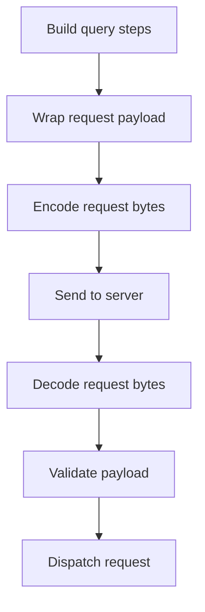
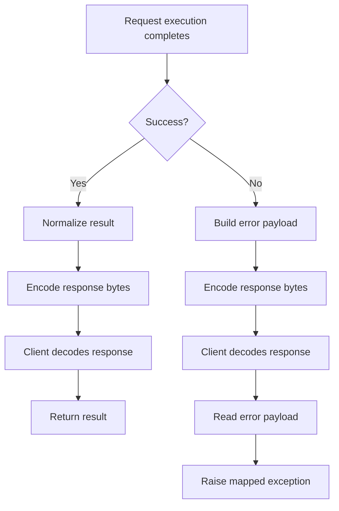

# Protocol

ShelfDB uses a small request/response protocol for trusted local clients.

This page explains the layer above byte-level transport: query steps become payloads, and payloads become bytes.

If you only need exact symbols and signatures, see the [API Reference](api-reference.md#protocol).

## Which module to use

| Module | Use it for | Notes |
| --- | --- | --- |
| `schema.py` | typed protocol shapes | Dictify schemas and type aliases |
| `query.py` | serialized query steps | build the step objects that go inside payloads |
| `payload.py` | request/response envelopes | read, validate, and build protocol payloads |
| `codec.py` | wire bytes | encode/decode payloads with `dill` and `msgpack` |

## Request sequence



This shows the request moving from client-side construction to server-side validation and dispatch.

## Response flow



This shows both success and error responses after request execution.

## Transport

- Request encoding: `dill`
- Response encoding: `msgpack`

The transport is not a public interoperability format.

## Query request

```python
{
    "type": "query",
    "shelf": "note",
    "queries": [
        {
            "op": "key",
            "args": ["note-1"],
            "kwargs": {},
        },
    ],
}
```

Payload envelopes are validated strictly:

- query payloads must contain exactly `type`, `shelf`, and `queries`
- transaction payloads must contain exactly `type`, `write`, and `txs`
- each query step must contain exactly `op`, `args`, `kwargs`, and optional `write`

## Transaction request

```python
{
    "type": "transaction",
    "write": False,
    "txs": [
        {
            "shelf": "note",
            "queries": [
                {
                    "op": "put",
                    "args": ["note-1", {"title": "ShelfDB"}],
                    "kwargs": {},
                    "write": True,
                }
            ],
        }
    ],
}
```

## Query step

Each query step has this shape:

- `op`: operation name
- `args`: positional arguments as a list
- `kwargs`: keyword arguments as a dict
- `write`: optional boolean flag for write operations

## Response

Successful responses are the normalized result returned by the server.

Errors are encoded under the reserved `__error__` key:

```python
{
    "__error__": {
        "type": "AssertionError",
        "message": "...",
    }
}
```

The error envelope is validated as exactly one `__error__` key with nested `type` and `message` strings.

## What to import when

- Use `shelfdb.protocol.query` for building serialized query steps.
- Use `shelfdb.protocol.payload` for request/response envelope helpers.
- Use `shelfdb.protocol.codec` only when you need raw byte serialization.

## More reference

- [API Reference](api-reference.md) for exact module members.
- Source files: `src/shelfdb/protocol/schema.py`, `src/shelfdb/protocol/query.py`, `src/shelfdb/protocol/payload.py`, `src/shelfdb/protocol/codec.py`.
